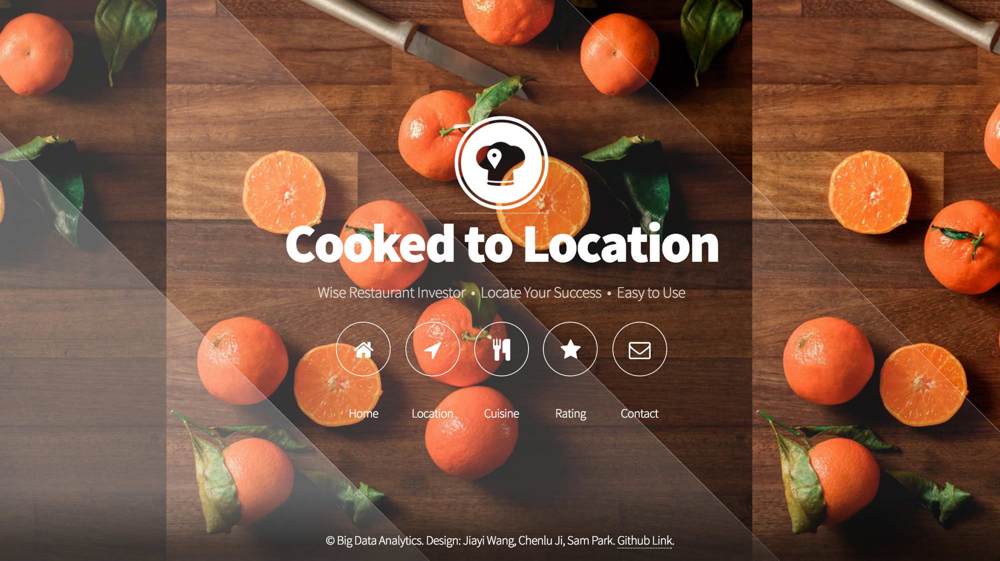

# Cooked_To_Location

This project is created by Chenlu Ji, Jiayi Wang and Sam Park for Big Data Analytics, Columbia University. 

Instructor: Prof. Ching-Yung Lin

In this project, we aim to do three things. Firstly, predict the location of a restaurant type based off the description of the restaurant, which would yield success of that restaurant. Secondly, based off the location, predict the type of restaurant that would yield to the success of the restaurant. And lastly, based off the location and restaurant type, predict the yelp rating. For recommendation, we utilized SQLite for database and queries of different conditions. For rating classification, Naïve Bayes, Decision Tree and Tree Ensemble models are implemented.

# How to use this Package

1. Download the whole package locally.
2. Install the dependencies: Hadoop, PySpark, Python 3.5.
3. Download the dataset (business.json and review.json) at https://www.yelp.com/dataset_challenge
4. Run the files in clean data folder to create csvs that are needed to create the database.
5. Run yelpDB.py in the app folder to create the database. You may need to change the path to csv files and call the right function to create the database.
6. Run Hadoop locally and make sure hdfs works normal. Create a directory user/admin in hdfs.
7. In terminal, cd to the app folder. Run path_to_your_pyspark/bin/spark-submit app.py
8. If everything runs correctly, open the address 127.0.0.1:5000/homepage in a browser. You will see the welcome page at the beginning of the introduction. Enjoy.
